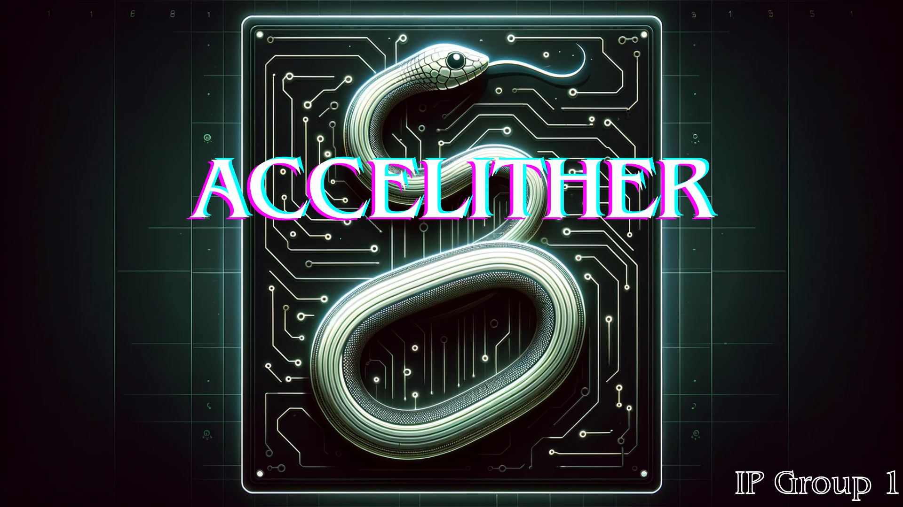
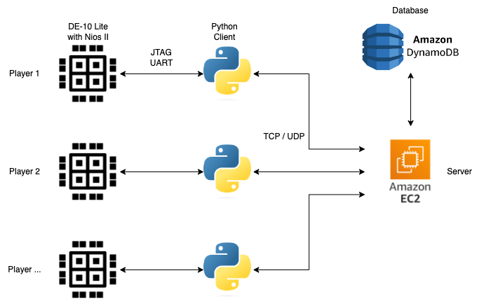

# Accelither: Multiplayer slither.io equivalent controlled via FPGA

<p align="center">
  
</p>

This repository contains an implementation of slither.io controlled via fpga, created as part of the EIE 2nd year Information Processing coursework at Imperial College London.

**Controls**:
  - You are able to freely move in any direction in an x-y plane through tilting the FPGA
  - Buttons on the FPGA allow acceleration and deceleration of the snake
  - Switches can alter the HUD - if a switch is activated its associated LED lights up
  - Current score is shown on the HEX display

This game can theoretically support any number of players but communication will eventually break down when number of players connected to the server becomes excessively large. 
It will also depend on how capable the server is.


## Architecture
<p align="center">
  
</p>

## Docs

### Repo structure
```
src/fpga/     # Contains all FPGA files
src/local/    # Contains all Game files
docs/         # Contains planning/repo imgs

```


### Executing our Project
**FPGA Setup**
- Clone repository locally
- In quartus select "Open Project" and navigate to the fpga folder and select the fpga_code QPF file
- Connect de10 lite FPGA
- Under tools in the top ribbon select programmer
- In the programmer next to hardware make sure USB Blaster is selected. If it is not it is most likely that the Device Driver had not been installed or loaded properly
- Select start to program your FPGA
- Back in the top ribbon under tools again select Nios II software build tools for eclipse (Quartus 18.1) 
- In Nios II eclipse right click on the navigator and import both the nios_code and nios_code_bsp folders (Only required once) 
- Right click on whatever you have named the nios_code folder and under `run as` select: `3. run as nios II hardware`
- In the project name dropdown in the pop up window select the name of the project again (whatever you named your nios_code) then select apply and run
- Close the nios II terminal
-  Open a terminal window (PowerShell on Windows) and execute Nios II Command Shell.bat in Quartus installation directory.
```powershell
& 'C:\intelFPGA_lite\23.1std\nios2eds\Nios II Command Shell.bat'
```
-  Then navigate to the nios_code where the `.elf` file is located, and use `nios2-download` to download the file to the FPGA board.
>
>    ```powershell
>    cd <your_elf_file_directory>
>    nios2-download -g <your_elf_file_name>.elf
>    ```
- Open a new terminal and execute Nios II Command Shell.bat again navigate to:

```powershell
& 'InfoProc_Proj/src/local/de10/stream'
```
and execute

```powershell
./accelerometer_stream.sh
```

The FPGA is now set up and streaming accelerometer data!

**Running the game**

- You will need to setup the server yourself, a way of doing this is launching an ubuntu 22.04 ec2 instance on AWS and adding a dynamodb IAM role. Then using filezilla or some other file transfer software move 
  - initiatedatabase.py
  - server.py (you will need to change the Host variable to your servers private IP before moving)
  - netcode 
  - media
  - database.py
  - game_pb2.py

  Over to the server. 
  
  Then ensure all required packages are installed e.g boto3 for dynamodb. Proceed to run
```python
initiatedatabase.py
```
in the server then finally execute 
```python
server.py
```
- Once the server is running go into client.py and change the HOST variable to your servers public IP
- Now you can finally locally execute client.py

*You should now be in Game !!!*
### Functional requirements
The initial requirments for this project were:

- Local processing of the accelerometer data.  

- Establishing a cloud server to process events/information 

- Communicating information from the node to the server. 

- Communicating information from the server back to the nodes in way that the local processing can be impacted.  

- Use of two nodes 

Through what we have built we have successfully achieved all of them.

### Planning

[Timeline](./docs/planning/Timeline.md)

[Game Design Document](./docs/planning/GDD.md)

[Role Allocation](./docs/planning/RoleAllocation.md)


